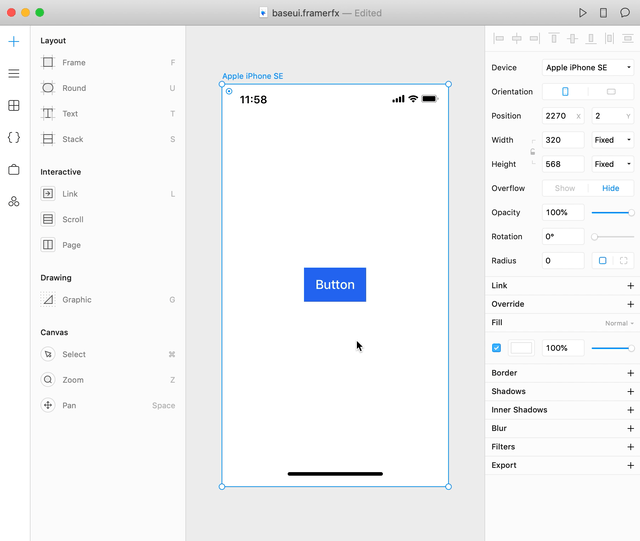

# Component Importer


The `component-importer` is a command line tool that makes it easy to import typescript-based React design systems into Framer X.

## Why Design Systems?

Design Systems lower engineering costs by keeping a single source of truth for your company's visual language. Recognized as valuable tools, design systems have been successfully deployed by the industry's most sofisticated players like [Google](https://material.io/design/), [Microsoft](https://developer.microsoft.com/en-us/fabric#/) and [Uber](https://baseweb.design/)), heck even the [UK](https://design-system.service.gov.uk/components/) and [US](https://designsystem.digital.gov/) government have one!

There's still one big problem though: production design systems are typically only accesible to technical designers, comfortable enough with the command line and familiar with common web development tooling like Webpack, Typescript/Flow, React/Angular, etc. This means that designers often end up having to maintain their own copy which is expensive to keep in sync.

## The Component Importer: keeping design and engineering in sync

The `component-importer` is a command line tool that analizes your production design system's source code and generates readable React code that can be loaded into visual design and prototyping tools like [Framer X](https://framer.com). Let's take a look at the generated code:

```ts
import * as React from "react" // <=== Section 1
import * as BaseUi from "baseui/button"
import { addPropertyControls, ControlType } from "framer"

function Button(props) { // <=== Section 2
	return <BaseUi.Button {...props} />
}

addPropertyControls(Button, { // <=== Section 3
	kind: { type: ControlType.Enum, defaultValue: "primary" },
	label: { type: ControlType.String },
	isLoading: { type: ControlType.Boolean, defaultValue: false },
})
```

If you work with react you will quickly understand Sections 1 and 2. We're importing the `Button` component from the `baseui` NPM package, and wrapping it in a function. The real interesting part is in Section 3 where, by analizing the Button's source code, we generate [property controls](https://www.framer.com/api/property-controls/) for the button. This means you can now drag your button to the canvas and modify it using a GUI that everyone can understand:



## The Goal: Increasing Design System Adoption

As a design system (DS) maintainer, your DS's value is proportional to its adoption. To be successful you will need to think not just about developing components, but also about making sure that they are well documented and convenient for your target audience, which will generally be engineers and designers. The `component-importer` tries to lower the barrier for designer adoption by making your team's production instantly available.

## Getting Started

To install run `yarn global add @framerjs/component-importer`. This will globally install the `component-importer` executable.

### Example: importing the [grommet](https://v2.grommet.io/) design system

Let's go through the process of importing the grommet design system from scratch.

### **Step 1**: project setup

Create a Framer X [folder backed project](https://www.framer.com/support/using-framer-x/folder-backed-projects/):

 - Create a new Framer X project
 - Hold Option and click File › Save As
 - In the save dialog, click the File Format dropdown and select "Framer X (Folder)"
 - Click Save

`.framerfx` projects are regular npm packages. Go to your favorite text editor and try to open the folder we just created. The contents should look something like this:

```
README.md
build/
code/
design/
metadata/
node_modules/
package.json
tsconfig.json
yarn.lock
```

So as you can see, it's a good ol' NPM package with it's `package.json` and `node_modules`. It has a `tsconfig.json`, since Framer X supports TypeScript by default.

### **Step 2**: add dependencies

Before we actually install grommet, we will first need to install grommet and its peer dependencies:

```bash
# cd into the project created in the previous step.
cd ~/my-project.framerfx

# Add grommet and styled-components, since its a peerDependency of grommet
yarn add grommet styled-components
```

### **Step 3**: Run the component-importer

In order to configure the component importer you will need to setup a configuration file, usually at the root of your project.
The `component-importer init` command will help you setup decent defaults.

The general syntax is `component importer init <packageName>`, example `component-importer init @blueprintjs/core` will attempt to import the "@blueprintjs/core" package.

```bash
component-importer init grommet
```

## Learn More

Looking to dive deeper into the `component-importer`, these guides are here to help:

- [Configuration](#): Fine tuning the `importer.config.json`.
- [Re-importing](#): How to keep your Framer X project in sync with your design system.
- [Designer UX](#): Tips and tricks on making your design system more accesible for designers.

## External Resources & Articles

Want to learn more about design systems?

- [Measuring Impact](https://medium.com/@didoo/measuring-the-impact-of-a-design-system-7f925af090f7)
  Cristiano Rastelli measures the impact of moving Badoo to a design system, filled with colorful charts 📊 and graphs 📈.
- [Estimating Costs & Value](https://uxdesign.cc/how-much-is-a-design-system-worth-d72e2ededf76)
  Trying to convince your manager about building a design systems? Bryn Rozzier explains a simple technique to estimating the [ROI](https://en.wikipedia.org/wiki/Return_on_investment) 💰 of building a design system.
- [Driving Adoption](https://segment.com/blog/driving-adoption-of-a-design-system/)
  Got a design system, but nobody is using it? Jeroen from segment.io explains what it took to convince other engineers to adopt [Evergreen](https://evergreen.segment.com/components/) 💗.

